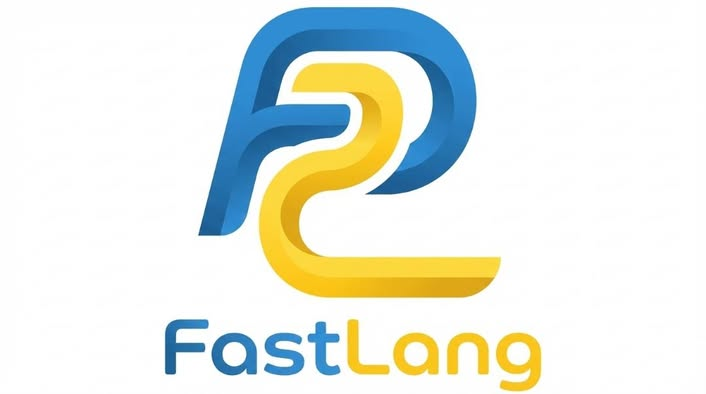

README.md for FastLang
#  FastLang

**FastLang** is a simple, stack-based programming language built in Python.  
It converts source code (`.fl` files) into bytecode which runs on a lightweight Virtual Machine (VM).  

---

## 🚀 Features

- Stack-based execution for fast and efficient operations
- Supports integers, variables, basic arithmetic, and print statements
- Easily extendable for loops, conditions, and more
- Minimal and clean design for learning language development

---

## 🗂️ Project Structure


FastLang/
│
├── src/
│ ├── lexer.py # Tokenizer (for future extensions)
│ ├── compiler.py # Converts FastLang code → bytecode
│ ├── bytecode.py # VM instruction set
│ ├── vm.py # Virtual Machine
│ └── init.py
│
├── examples/
│ └── test.fl # Example FastLang program
│
├── main.py # Entry point to run programs
├── README.md # Project documentation
├── requirements.txt # No external dependencies
└── .vscode/
└── launch.json # VS Code run configuration


---

## 🏃 How to Run

1. Make sure Python 3.9+ is installed.
2. Run the example bytecode in `main.py`:

```bash
python main.py


To run a .fl program:

from src.compiler import Compiler
from src.vm import VirtualMachine

compiler = Compiler()
bytecode = compiler.compile("examples/test.fl")

vm = VirtualMachine()
vm.run(bytecode)

✏️ Example .fl Program
let x = 10
let y = 5
print x + y


Output:

15

⚡ Efficiency

Stack-based operations for fast execution

Minimal runtime overhead

Easy to extend with new instructions

🛠️ Future Work

Add loops and conditionals

Add functions and reusable code

Syntax highlighting support

Error handling improvements
